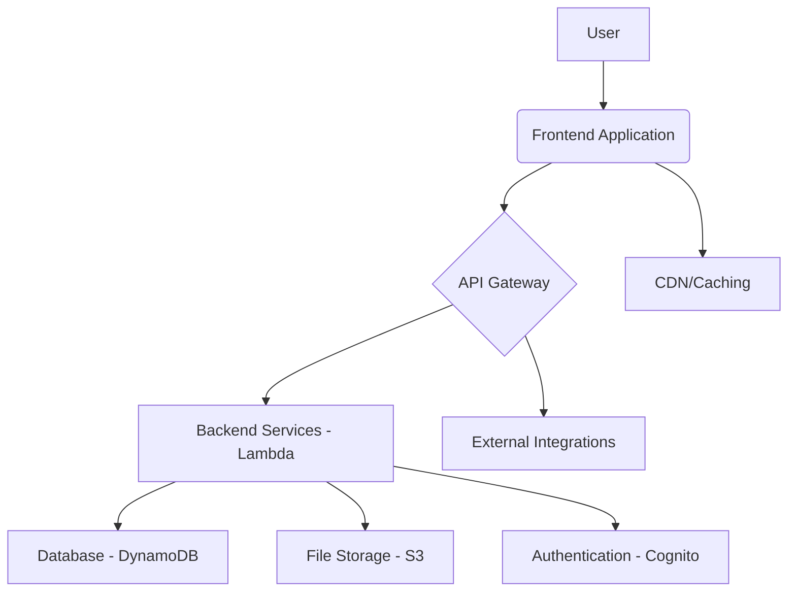
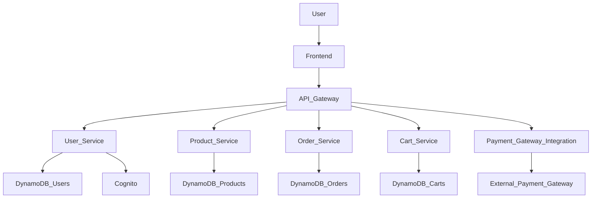
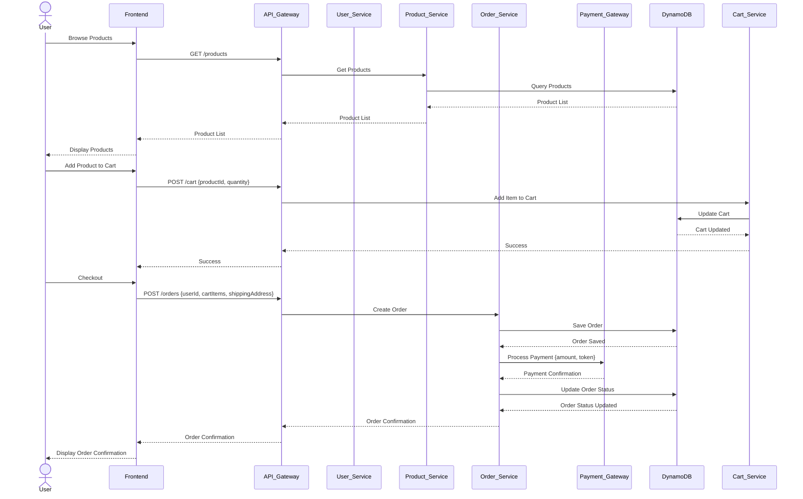
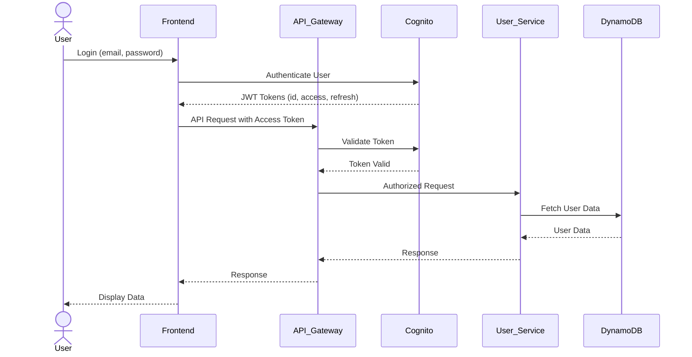
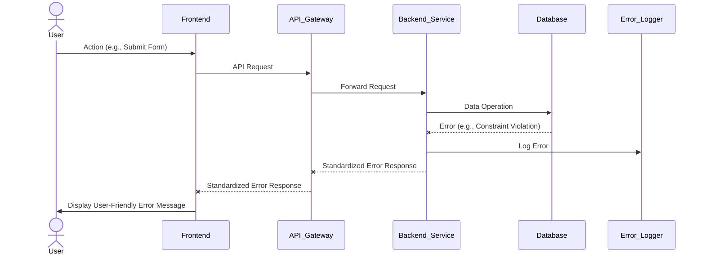

# ecommerce Fullstack Architecture Document

## Introduction
This document outlines the complete fullstack architecture for ecommerce, including backend systems, frontend implementation, and their integration. It serves as the single source of truth for AI-driven development, ensuring consistency across the entire technology stack.

This unified approach combines what would traditionally be separate backend and frontend architecture documents, streamlining the development process for modern fullstack applications where these concerns are increasingly intertwined.

### Starter Template or Existing Project
N/A - Greenfield project

### Change Log
| Date | Version | Description | Author |
|---|---|---|---|

## High Level Architecture

### Technical Summary
This architecture employs a modern fullstack approach, utilizing a component-based frontend and a microservices-oriented backend. The frontend and backend communicate via a RESTful API. The application will be deployed on a cloud platform, leveraging serverless functions for scalability and cost-efficiency. This architecture is designed to meet the performance, scalability, and maintainability goals outlined in the PRD.

### Platform and Infrastructure Choice
**Platform:** AWS
**Key Services:** AWS Lambda, API Gateway, DynamoDB, S3, Cognito
**Deployment Host and Regions:** us-east-1

### Repository Structure
**Structure:** Monorepo
**Monorepo Tool:** Nx
**Package Organization:** `apps/` for applications (web, api), `packages/` for shared code (shared types, UI components, config)

### High Level Architecture Diagram


### Architectural Patterns
- **Serverless Architecture:** Utilizing AWS Lambda for backend services - _Rationale:_ Scalability, reduced operational overhead, and cost-efficiency.
- **Component-Based UI:** Reusable React components with TypeScript - _Rationale:_ Promotes reusability, maintainability, and type safety across the frontend codebase.
- **Repository Pattern:** Abstract data access logic - _Rationale:_ Decouples business logic from data storage details, enabling easier testing and future database migration flexibility.
- **API Gateway Pattern:** Single entry point for all API calls - _Rationale:_ Centralizes concerns like authentication, rate limiting, and monitoring for backend services.

## Tech Stack

### Technology Stack Table
| Category | Technology | Version | Purpose | Rationale |
|---|---|---|---|---|
| Frontend Language | TypeScript | 5.x | Type safety and improved developer experience | Enhances code quality and maintainability |
| Frontend Framework | React | 18.x | Declarative UI development | Popular, robust, and large community support |
| UI Component Library | Material-UI | 5.x | Pre-built, customizable UI components | Accelerates UI development and ensures consistent design |
| State Management | Zustand | 4.x | Simple, fast, and scalable state management | Lightweight and easy to use for global state |
| Backend Language | TypeScript | 5.x | Consistency with frontend, strong typing | Reduces errors and improves code quality |
| Backend Framework | Node.js (Express) | 18.x | Fast, scalable backend development | Lightweight, flexible, and widely adopted |
| API Style | REST | 1.0 | Standardized, flexible API communication | Widely understood and supported |
| Database | DynamoDB | N/A | NoSQL database for high performance and scalability | Serverless, highly available, and scales automatically |
| Cache | Redis | 7.x | In-memory data store for caching | High performance caching for frequently accessed data |
| File Storage | AWS S3 | N/A | Scalable object storage | Highly durable, available, and cost-effective for static assets |
| Authentication | AWS Cognito | N/A | User authentication and authorization | Managed service, integrates well with AWS ecosystem |
| Frontend Testing | Jest, React Testing Library | 29.x, 14.x | Unit and integration testing for React components | Comprehensive testing framework for frontend |
| Backend Testing | Jest, Supertest | 29.x, 6.x | Unit and integration testing for Node.js APIs | Enables robust testing of backend logic |
| E2E Testing | Cypress | 12.x | End-to-end testing for user flows | Simulates real user interactions for comprehensive testing |
| Build Tool | Webpack | 5.x | Module bundler for frontend assets | Optimizes frontend assets for production |
| Bundler | Nx | 16.x | Monorepo build system | Streamlines development and builds in a monorepo setup |
| IaC Tool | AWS CDK | 2.x | Infrastructure as Code | Defines cloud resources programmatically for consistency |
| CI/CD | GitHub Actions | N/A | Automated build, test, and deployment pipeline | Integrates with GitHub, flexible and extensible |
| Monitoring | AWS CloudWatch | N/A | Monitoring and logging for AWS resources | Centralized monitoring for cloud infrastructure |
| Logging | AWS CloudWatch Logs | N/A | Centralized log management | Collects and stores logs from all application components |
| CSS Framework | Tailwind CSS | 3.x | Utility-first CSS framework | Rapid UI development with highly customizable styles |

## Data Models

### User
**Purpose:** Represents a user of the e-commerce platform.

**Key Attributes:**
- `id`: `string` - Unique identifier for the user.
- `email`: `string` - User's email address (unique).
- `passwordHash`: `string` - Hashed password for security.
- `firstName`: `string` - User's first name.
- `lastName`: `string` - User's last name.
- `createdAt`: `string` - Timestamp of user creation.
- `updatedAt`: `string` - Timestamp of last user update.

#### TypeScript Interface
```typescript
interface User {
  id: string;
  email: string;
  passwordHash: string;
  firstName: string;
  lastName: string;
  createdAt: string;
  updatedAt: string;
}
```

#### Relationships
- One-to-many with `Order` (a user can have many orders)
- One-to-many with `Address` (a user can have many addresses)

### Product
**Purpose:** Represents a product available for sale on the e-commerce platform.

**Key Attributes:**
- `id`: `string` - Unique identifier for the product.
- `name`: `string` - Name of the product.
- `description`: `string` - Detailed description of the product.
- `price`: `number` - Price of the product.
- `imageUrl`: `string` - URL of the product image.
- `category`: `string` - Category of the product.
- `stock`: `number` - Current stock quantity.
- `createdAt`: `string` - Timestamp of product creation.
- `updatedAt`: `string` - Timestamp of last product update.

#### TypeScript Interface
```typescript
interface Product {
  id: string;
  name: string;
  description: string;
  price: number;
  imageUrl: string;
  category: string;
  stock: number;
  createdAt: string;
  updatedAt: string;
  updatedAt: string;
}
```

#### Relationships
- Many-to-many with `Order` (through `OrderItem`)

### Order
**Purpose:** Represents a customer order.

**Key Attributes:**
- `id`: `string` - Unique identifier for the order.
- `userId`: `string` - ID of the user who placed the order.
- `orderDate`: `string` - Date and time the order was placed.
- `totalAmount`: `number` - Total amount of the order.
- `status`: `string` - Current status of the order (e.g., "pending", "shipped", "delivered").
- `shippingAddressId`: `string` - ID of the shipping address.
- `createdAt`: `string` - Timestamp of order creation.
- `updatedAt`: `string` - Timestamp of last order update.

#### TypeScript Interface
```typescript
interface Order {
  id: string;
  userId: string;
  orderDate: string;
  totalAmount: number;
  status: string;
  shippingAddressId: string;
  createdAt: string;
  updatedAt: string;
}
```

#### Relationships
- Many-to-one with `User` (an order belongs to one user)
- One-to-many with `OrderItem` (an order can have many items)
- Many-to-one with `Address` (an order has one shipping address)

### OrderItem
**Purpose:** Represents a single item within an order.

**Key Attributes:**
- `id`: `string` - Unique identifier for the order item.
- `orderId`: `string` - ID of the order this item belongs to.
- `productId`: `string` - ID of the product in this order item.
- `quantity`: `number` - Quantity of the product.
- `price`: `number` - Price of the product at the time of order.

#### TypeScript Interface
```typescript
interface OrderItem {
  id: string;
  orderId: string;
  productId: string;
  quantity: number;
  price: number;
}
```

#### Relationships
- Many-to-one with `Order` (an order item belongs to one order)
- Many-to-one with `Product` (an order item refers to one product)

### Address
**Purpose:** Represents a user's address.

**Key Attributes:**
- `id`: `string` - Unique identifier for the address.
- `userId`: `string` - ID of the user this address belongs to.
- `street`: `string` - Street name and number.
- `city`: `string` - City.
- `state`: `string` - State/Province.
- `zipCode`: `string` - Zip/Postal code.
- `country`: `string` - Country.
- `isDefault`: `boolean` - Whether this is the user's default address.

#### TypeScript Interface
```typescript
interface Address {
  id: string;
  userId: string;
  street: string;
  city: string;
  state: string;
  zipCode: string;
  country: string;
  isDefault: boolean;
}
```

#### Relationships
- Many-to-one with `User` (an address belongs to one user)
- One-to-many with `Order` (an address can be a shipping address for many orders)

## API Specification

### REST API Specification
```yaml
openapi: 3.0.0
info:
  title: E-commerce API
  version: 1.0.0
  description: API for the e-commerce platform
servers:
  - url: https://api.ecommerce.com/v1
    description: Production server
```

## Components

### User Management Service
**Responsibility:** Handles user registration, login, profile management, and authentication.

**Key Interfaces:**
- User registration API (`POST /users/register`)
- User login API (`POST /users/login`)
- User profile API (`GET /users/{id}`, `PUT /users/{id}`)

**Dependencies:** DynamoDB (for user data), AWS Cognito (for authentication)

**Technology Stack:** AWS Lambda, Node.js, Express.js

### Product Catalog Service
**Responsibility:** Manages product information, including creation, retrieval, update, and deletion of products.

**Key Interfaces:**
- Get all products API (`GET /products`)
- Get product by ID API (`GET /products/{id}`)
- Create product API (`POST /products`)

**Dependencies:** DynamoDB (for product data)

**Technology Stack:** AWS Lambda, Node.js, Express.js

### Order Processing Service
**Responsibility:** Manages the lifecycle of customer orders, from creation to fulfillment.

**Key Interfaces:**
- Create order API (`POST /orders`)
- Get order by ID API (`GET /orders/{id}`)
- Update order status API (`PUT /orders/{id}/status`)

**Dependencies:** DynamoDB (for order and order item data), Product Catalog Service

**Technology Stack:** AWS Lambda, Node.js, Express.js

### Shopping Cart Service
**Responsibility:** Manages items in a user's shopping cart.

**Key Interfaces:**
- Add item to cart API (`POST /cart`)
- Get cart contents API (`GET /cart`)
- Update cart item quantity API (`PUT /cart/{productId}`)
- Remove item from cart API (`DELETE /cart/{productId}`)

**Dependencies:** DynamoDB (for cart data), Product Catalog Service

**Technology Stack:** AWS Lambda, Node.js, Express.js

### Payment Gateway Integration
**Responsibility:** Handles secure processing of payments.

**Key Interfaces:**
- Process payment API (`POST /payments`)

**Dependencies:** External Payment Gateway API (e.g., Stripe, PayPal)

**Technology Stack:** AWS Lambda, Node.js

### Component Diagrams


## External APIs

### Stripe API
- **Purpose:** Payment processing.
- **Documentation:** https://stripe.com/docs/api
- **Base URL(s):** https://api.stripe.com/v1
- **Authentication:** API Key (Bearer Token)
- **Rate Limits:** Varies by endpoint, typically 100-200 requests/second.

**Key Endpoints Used:**
- `POST /v1/charges` - Create a new charge.

**Integration Notes:** Webhooks will be used to receive payment status updates.

## Core Workflows



## Database Schema

```sql
-- User Table
CREATE TABLE Users (
    id VARCHAR(255) PRIMARY KEY,
    email VARCHAR(255) UNIQUE NOT NULL,
    passwordHash VARCHAR(255) NOT NULL,
    firstName VARCHAR(255),
    lastName VARCHAR(255),
    createdAt TIMESTAMP DEFAULT CURRENT_TIMESTAMP,
    updatedAt TIMESTAMP DEFAULT CURRENT_TIMESTAMP ON UPDATE CURRENT_TIMESTAMP
);

-- Product Table
CREATE TABLE Products (
    id VARCHAR(255) PRIMARY KEY,
    name VARCHAR(255) NOT NULL,
    description TEXT,
    price DECIMAL(10, 2) NOT NULL,
    imageUrl VARCHAR(255),
    category VARCHAR(255),
    stock INT NOT NULL,
    createdAt TIMESTAMP DEFAULT CURRENT_TIMESTAMP,
    updatedAt TIMESTAMP DEFAULT CURRENT_TIMESTAMP ON UPDATE CURRENT_TIMESTAMP
);

-- Order Table
CREATE TABLE Orders (
    id VARCHAR(255) PRIMARY KEY,
    userId VARCHAR(255) NOT NULL,
    orderDate TIMESTAMP DEFAULT CURRENT_TIMESTAMP,
    totalAmount DECIMAL(10, 2) NOT NULL,
    status VARCHAR(50) NOT NULL,
    shippingAddressId VARCHAR(255),
    createdAt TIMESTAMP DEFAULT CURRENT_TIMESTAMP,
    updatedAt TIMESTAMP DEFAULT CURRENT_TIMESTAMP ON UPDATE CURRENT_TIMESTAMP,
    FOREIGN KEY (userId) REFERENCES Users(id),
    FOREIGN KEY (shippingAddressId) REFERENCES Addresses(id)
);

-- OrderItem Table
CREATE TABLE OrderItems (
    id VARCHAR(255) PRIMARY KEY,
    orderId VARCHAR(255) NOT NULL,
    productId VARCHAR(255) NOT NULL,
    quantity INT NOT NULL,
    price DECIMAL(10, 2) NOT NULL,
    FOREIGN KEY (orderId) REFERENCES Orders(id),
    FOREIGN KEY (productId) REFERENCES Products(id)
);

-- Address Table
CREATE TABLE Addresses (
    id VARCHAR(255) PRIMARY KEY,
    userId VARCHAR(255) NOT NULL,
    street VARCHAR(255) NOT NULL,
    city VARCHAR(255) NOT NULL,
    state VARCHAR(255),
    zipCode VARCHAR(20),
    country VARCHAR(255) NOT NULL,
    isDefault BOOLEAN DEFAULT FALSE,
    FOREIGN KEY (userId) REFERENCES Users(id)
);
```

### Data Management
- **Data Migration:** Database schema changes will be managed using AWS CDK for DynamoDB table updates. For relational databases (if used in the future), Alembic or similar migration tools would be employed.
- **Data Seeding:** Initial data (e.g., product categories, sample products) will be loaded via scripts during deployment or development setup.
- **Data Backup:** DynamoDB tables will utilize point-in-time recovery. Critical S3 buckets will have versioning and cross-region replication enabled.
- **Data Recovery:** Recovery procedures will involve restoring from point-in-time backups for DynamoDB and S3, and re-deploying infrastructure via AWS CDK.

## Frontend Architecture

### Component Architecture

#### Component Organization
```text
src/
├── components/         # Reusable UI components (e.g., Button, Card, Modal)
│   ├── common/
│   ├── layout/
│   └── specific/
├── pages/              # Page-level components (e.g., HomePage, ProductDetailPage)
├── hooks/              # Custom React hooks for reusable logic
├── services/           # API client services for backend communication
├── store/              # Zustand stores for global state management
├── styles/             # Global styles, themes, Tailwind CSS configuration
├── utils/              # Frontend utility functions
└── App.tsx             # Main application component
```

#### Component Template
```typescript
import React from 'react';

interface MyComponentProps {
  // Define props here
  title: string;
}

const MyComponent: React.FC<MyComponentProps> = ({ title }) => {
  return (
    <div>
      <h1>{title}</h1>
      <p>This is a generic component.</p>
    </div>
  );
};

export default MyComponent;
```

### State Management Architecture

#### State Structure
```typescript
interface AppState {
  user: User | null;
  cart: CartState;
  products: Product[];
  // ... other global states
}

interface CartState {
  items: { productId: string; quantity: number; }[];
  total: number;
}
```

#### State Management Patterns
- **Zustand Stores:** For global application state, each domain (e.g., user, cart, products) will have its own store.
- **Local Component State:** For UI-specific state that doesn't need to be shared globally.
- **Derived State:** Using selectors to compute derived state from existing stores to avoid redundancy.

### Routing Architecture

#### Route Organization
```text
src/
├── router/
│   ├── index.tsx       # Main router configuration
│   ├── routes.tsx      # Defines all application routes
│   └── ProtectedRoute.tsx # Component for protected routes
├── pages/
│   ├── auth/
│   │   ├── LoginPage.tsx
│   │   └── RegisterPage.tsx
│   ├── products/
│   │   ├── ProductListPage.tsx
│   │   └── ProductDetailPage.tsx
│   ├── cart/
│   │   └── CartPage.tsx
│   ├── checkout/
│   │   └── CheckoutPage.tsx
│   └── user/
│       └── ProfilePage.tsx
```

#### Protected Route Pattern
```typescript
import React from 'react';
import { Navigate, Outlet } from 'react-router-dom';
import { useAuthStore } from '../store/authStore'; // Assuming Zustand auth store

const ProtectedRoute: React.FC = () => {
  const isAuthenticated = useAuthStore((state) => state.isAuthenticated);

  if (!isAuthenticated) {
    return <Navigate to="/login" replace />;
  }

  return <Outlet />;
};

export default ProtectedRoute;
```

### Frontend Services Layer

#### API Client Setup
```typescript
import axios from 'axios';

const apiClient = axios.create({
  baseURL: process.env.REACT_APP_API_BASE_URL || 'http://localhost:3000/api',
  headers: {
    'Content-Type': 'application/json',
  },
});

apiClient.interceptors.request.use(
  (config) => {
    const token = localStorage.getItem('authToken'); // Or from a state management store
    if (token) {
      config.headers.Authorization = `Bearer ${token}`;
    }
    return config;
  },
  (error) => Promise.reject(error)
);

export default apiClient;
```

#### Service Example
```typescript
import apiClient from './apiClient';
import { Product } from '../types'; // Assuming shared types

export const productService = {
  getAllProducts: async (): Promise<Product[]> => {
    const response = await apiClient.get('/products');
    return response.data;
  },

  getProductById: async (id: string): Promise<Product> => {
    const response = await apiClient.get(`/products/${id}`);
    return response.data;
  },

  // ... other product-related API calls
};
```

## Backend Architecture

### Service Architecture

#### Serverless Architecture
##### Function Organization
```text
src/
├── functions/          # Individual Lambda functions
│   ├── users/
│   │   ├── createUser.ts
│   │   ├── getUser.ts
│   │   └── loginUser.ts
│   ├── products/
│   │   ├── getProducts.ts
│   │   └── createProduct.ts
│   └── orders/
│       ├── createOrder.ts
│       └── getOrder.ts
├── services/           # Business logic modules shared across functions
├── models/             # Data models/interfaces
├── utils/              # Utility functions
└── config/             # Configuration files
```

##### Function Template
```typescript
import { APIGatewayProxyEvent, APIGatewayProxyResult } from 'aws-lambda';
import { successResponse, errorResponse } from '../utils/apiResponses'; // Assuming utility for responses

export const handler = async (event: APIGatewayProxyEvent): Promise<APIGatewayProxyResult> => {
  try {
    // Your function logic here
    const data = { message: 'Hello from Lambda!' };
    return successResponse(200, data);
  } catch (error) {
    console.error(error);
    return errorResponse(500, 'Internal Server Error');
  }
};
```

### Database Architecture

#### Schema Design
```sql
-- DynamoDB tables will be defined using AWS CDK or Serverless Framework.
-- Example:
-- Users Table:
-- Partition Key: id (String)
-- Attributes: email (String), passwordHash (String), firstName (String), lastName (String), createdAt (String), updatedAt (String)
-- Global Secondary Index: email-index (Partition Key: email)

-- Products Table:
-- Partition Key: id (String)
-- Attributes: name (String), description (String), price (Number), imageUrl (String), category (String), stock (Number), createdAt (String), updatedAt (String)
-- Global Secondary Index: category-index (Partition Key: category)

-- Orders Table:
-- Partition Key: id (String)
-- Attributes: userId (String), orderDate (String), totalAmount (Number), status (String), shippingAddressId (String), createdAt (String), updatedAt (String)
-- Global Secondary Index: userId-index (Partition Key: userId)

-- OrderItems Table:
-- Partition Key: id (String)
-- Attributes: orderId (String), productId (String), quantity (Number), price (Number)
-- Global Secondary Index: orderId-index (Partition Key: orderId)

-- Addresses Table:
-- Partition Key: id (String)
-- Attributes: userId (String), street (String), city (String), state (String), zipCode (String), country (String), isDefault (Boolean)
-- Global Secondary Index: userId-index (Partition Key: userId)
```

#### Data Access Layer
```typescript
import { DynamoDBClient } from '@aws-sdk/client-dynamodb';
import { DynamoDBDocumentClient, GetCommand, PutCommand, UpdateCommand, DeleteCommand, QueryCommand } from '@aws-sdk/lib-dynamodb';
import { User } from '../models/User'; // Assuming User model

const client = new DynamoDBClient({});
const ddbDocClient = DynamoDBDocumentClient.from(client);

export const userRepository = {
  async getUserById(id: string): Promise<User | undefined> {
    const command = new GetCommand({
      TableName: 'Users',
      Key: { id },
    });
    const { Item } = await ddbDocClient.send(command);
    return Item as User;
  },

  async createUser(user: User): Promise<User> {
    const command = new PutCommand({
      TableName: 'Users',
      Item: user,
    });
    await ddbDocClient.send(command);
    return user;
  },

  // ... other CRUD operations for User
};
```

### Authentication and Authorization

#### Auth Flow


#### Middleware/Guards
```typescript
// Example Express.js middleware for token validation (if not using API Gateway's built-in auth)
import { Request, Response, NextFunction } from 'express';
import jwt from 'jsonwebtoken';

interface AuthenticatedRequest extends Request {
  user?: { id: string; email: string; };
}

export const authenticateToken = (req: AuthenticatedRequest, res: Response, next: NextFunction) => {
  const authHeader = req.headers['authorization'];
  const token = authHeader && authHeader.split(' ')[1];

  if (token == null) return res.sendStatus(401); // No token

  jwt.verify(token, process.env.JWT_SECRET as string, (err: any, user: any) => {
    if (err) return res.sendStatus(403); // Invalid token
    req.user = user;
    next();
  });
};
```

## Unified Project Structure

```plaintext
ecommerce/
├── .github/                    # CI/CD workflows
│   └── workflows/
│       ├── ci.yaml
│       └── deploy.yaml
├── apps/                       # Application packages
│   ├── web/                    # Frontend application
│   │   ├── src/
│   │   │   ├── components/     # UI components
│   │   │   ├── pages/          # Page components/routes
│   │   │   ├── hooks/          # Custom React hooks
│   │   │   ├── services/       # API client services
│   │   │   ├── store/          # Zustand stores
│   │   │   ├── styles/         # Global styles/themes
│   │   │   └── utils/          # Frontend utilities
│   │   ├── public/             # Static assets
│   │   ├── tests/              # Frontend tests
│   │   └── package.json
│   └── api/                    # Backend application (Lambda functions)
│       ├── src/
│       │   ├── functions/      # Individual Lambda functions
│       │   ├── services/       # Business logic
│       │   ├── models/         # Data models
│       │   ├── utils/          # Backend utilities
│       │   └── handlers.ts     # Entry point for serverless functions
│       ├── tests/              # Backend tests
│       └── package.json
├── packages/                   # Shared packages
│   ├── shared/                 # Shared types/utilities
│   │   ├── src/
│   │   │   ├── types/          # TypeScript interfaces
│   │   │   ├── constants/      # Shared constants
│   │   │   └── utils/          # Shared utilities
│   │   └── package.json
│   ├── ui/                     # Shared UI components (if applicable)
│   │   ├── src/
│   │   └── package.json
│   └── config/                 # Shared configuration
│       ├── eslint/
│       ├── typescript/
│       └── jest/
├── infrastructure/             # IaC definitions (AWS CDK)
│   └── lib/
│       └── ecommerce-stack.ts
├── scripts/                    # Build/deploy scripts
├── docs/                       # Documentation
│   ├── prd.md
│   ├── front-end-spec.md
│   └── architecture.md
├── .env.example                # Environment template
├── package.json                # Root package.json
├── nx.json                     # Nx monorepo configuration
└── README.md
```

## Development Workflow

### Local Development Setup

#### Prerequisites
```bash
# Node.js (v18 or later)
# npm (v8 or later)
# AWS CLI configured
# Docker (for local DynamoDB/Redis if needed)
```

#### Initial Setup
```bash
npm install -g nx # Install Nx globally
npm install       # Install root dependencies
nx run api:serve  # Start local backend (if applicable)
nx run web:serve  # Start local frontend
```

#### Development Commands
```bash
# Start all services
nx run-many --target=serve --all

# Start frontend only
nx run web:serve

# Start backend only
nx run api:serve

# Run tests
nx run-many --target=test --all
```

### Environment Configuration

#### Required Environment Variables
```bash
# Frontend (.env.local)
REACT_APP_API_BASE_URL=http://localhost:3000/api
REACT_APP_COGNITO_USER_POOL_ID=us-east-1_XXXXXXX
REACT_APP_COGNITO_CLIENT_ID=XXXXXXXXXXXXXXXXXXXXXX

# Backend (.env)
AWS_REGION=us-east-1
DYNAMODB_TABLE_USERS=ecommerce-users
DYNAMODB_TABLE_PRODUCTS=ecommerce-products
JWT_SECRET=your_jwt_secret_key
STRIPE_SECRET_KEY=sk_test_XXXXXXXXXXXXXXXXXXXX

# Shared
# No shared environment variables directly accessed by both frontend and backend
```

## Deployment Architecture

### Deployment Strategy
**Frontend Deployment:**
- **Platform:** AWS Amplify (or Vercel/Netlify)
- **Build Command:** `nx build web`
- **Output Directory:** `dist/apps/web`
- **CDN/Edge:** CloudFront

**Backend Deployment:**
- **Platform:** AWS Lambda via Serverless Framework/AWS CDK
- **Build Command:** `nx build api`
- **Deployment Method:** Serverless deployment (e.g., `serverless deploy` or `cdk deploy`)

### CI/CD Pipeline
```yaml
name: CI/CD Pipeline

on:
  push:
    branches:
      - main
  pull_request:
    branches:
      - main

jobs:
  build-and-test:
    runs-on: ubuntu-latest
    steps:
      - name: Checkout code
        uses: actions/checkout@v3

      - name: Setup Node.js
        uses: actions/setup-node@v3
        with:
          node-version: '18'
          cache: 'npm'

      - name: Install dependencies
        run: npm install

      - name: Run tests
        run: nx run-many --target=test --all

      - name: Build applications
        run: nx run-many --target=build --all

  deploy-frontend:
    needs: build-and-test
    if: github.ref == 'refs/heads/main'
    runs-on: ubuntu-latest
    steps:
      - name: Checkout code
        uses: actions/checkout@v3

      - name: Configure AWS credentials
        uses: aws-actions/configure-aws-credentials@v1
        with:
          aws-access-key-id: ${{ secrets.AWS_ACCESS_KEY_ID }}
          aws-secret-access-key: ${{ secrets.AWS_SECRET_ACCESS_KEY }}
          aws-region: us-east-1

      - name: Deploy Frontend to Amplify
        run: |
          # Example for Amplify CLI deployment
          npm install -g @aws-amplify/cli
          amplify publish --yes # Assuming Amplify project is set up

  deploy-backend:
    needs: build-and-test
    if: github.ref == 'refs/heads/main'
    runs-on: ubuntu-latest
    steps:
      - name: Checkout code
        uses: actions/checkout@v3

      - name: Setup Node.js
        uses: actions/setup-node@v3
        with:
          node-version: '18'
          cache: 'npm'

      - name: Install Serverless Framework
        run: npm install -g serverless

      - name: Configure AWS credentials
        uses: aws-actions/configure-aws-credentials@v1
        with:
          aws-access-key-id: ${{ secrets.AWS_ACCESS_KEY_ID }}
          aws-secret-access-key: ${{ secrets.AWS_SECRET_ACCESS_KEY }}
          aws-region: us-east-1

      - name: Deploy Backend Services
        run: |
          cd apps/api
          serverless deploy --stage production # Or use AWS CDK deploy command
```

### Environments
| Environment | Frontend URL | Backend URL | Purpose |
|---|---|---|---|
| Development | `http://localhost:4200` | `http://localhost:3000/api` | Local development |
| Staging | `https://staging.ecommerce.com` | `https://api.staging.ecommerce.com/v1` | Pre-production testing |
| Production | `https://www.ecommerce.com` | `https://api.ecommerce.com/v1` | Live environment |

### Rollback and Recovery
- **Rollback Strategy:** Automated rollbacks will be configured for failed deployments via CI/CD pipelines. Manual rollbacks will be supported by deploying previous stable versions.
- **Recovery Procedures:** Disaster recovery plans will include regular backups of DynamoDB and S3, and infrastructure rehydration using AWS CDK. RTO and RPO objectives will be defined.

### Reliability and Resilience
- **Retry Policies:** Implemented for external API calls and database operations with exponential backoff.
- **Circuit Breakers:** Applied to critical external service integrations to prevent cascading failures.
- **Graceful Degradation:** Core functionalities will remain operational even if non-critical services are degraded or unavailable.
- **System Recovery:** Automated health checks and auto-scaling will ensure the system can recover from instance failures and handle traffic spikes.

### Rollback and Recovery
- **Rollback Strategy:** Automated rollbacks will be configured for failed deployments via CI/CD pipelines. Manual rollbacks will be supported by deploying previous stable versions.
- **Recovery Procedures:** Disaster recovery plans will include regular backups of DynamoDB and S3, and infrastructure rehydration using AWS CDK. RTO and RPO objectives will be defined.

### Reliability and Resilience
- **Retry Policies:** Implemented for external API calls and database operations with exponential backoff.
- **Circuit Breakers:** Applied to critical external service integrations to prevent cascading failures.
- **Graceful Degradation:** Core functionalities will remain operational even if non-critical services are degraded or unavailable.
- **System Recovery:** Automated health checks and auto-scaling will ensure the system can recover from instance failures and handle traffic spikes.

## Security and Performance

### Security Requirements
**Frontend Security:**
- CSP Headers: `default-src 'self'; script-src 'self' 'unsafe-inline'; style-src 'self' 'unsafe-inline';`
- XSS Prevention: React's automatic escaping, sanitize user-generated content.
- Secure Storage: Use `localStorage` for non-sensitive tokens (short-lived access tokens), `httpOnly` cookies for refresh tokens.

**Backend Security:**
- Input Validation: Joi/Yup for schema validation on all incoming API requests.
- Rate Limiting: Express-rate-limit middleware for API endpoints.
- CORS Policy: Restrict origins to known frontend domains.
- **Data Encryption:** All data at rest (DynamoDB, S3) will be encrypted using AWS KMS. Data in transit will be encrypted using TLS/HTTPS.
- **Sensitive Data Handling:** PCI DSS compliance will be considered for simulated payment data. No sensitive user data will be logged directly.
- **Access Control:** Role-Based Access Control (RBAC) will be implemented based on user roles (Buyer, Store Manager, Admin) to restrict access to specific API endpoints and data.

**Authentication Security:**
- Token Storage: Access tokens in memory/localStorage (short-lived), refresh tokens in `httpOnly` cookies.
- Session Management: JWT-based stateless sessions.
- Password Policy: Minimum 8 characters, mix of uppercase, lowercase, numbers, and symbols. Hashing with bcrypt.
- **Infrastructure Security:** Network segmentation using VPCs and subnets. Security Groups will be configured for least privilege access. AWS WAF will be used for common web exploits.

### Performance Optimization
**Frontend Performance:**
- Bundle Size Target: < 500KB (gzipped)
- Loading Strategy: Lazy loading for routes and components, code splitting.
- Caching Strategy: Service Workers for PWA caching, HTTP caching for static assets.

**Backend Performance:**
- Response Time Target: < 100ms for critical APIs
- Database Optimization: Proper indexing, efficient queries, connection pooling.
- Caching Strategy: Redis for frequently accessed data (e.g., product details, user sessions).

## Testing Strategy

### Testing Pyramid
```text
          E2E Tests
         /        \
    Integration Tests
       /            \
  Frontend Unit  Backend Unit
```

### Test Organization

#### Frontend Tests
```text
apps/web/
├── src/
│   ├── components/
│   │   └── Button/
│   │       └── Button.test.tsx # Unit tests for components
│   ├── pages/
│   │   └── HomePage/
│   │       └── HomePage.test.tsx # Integration tests for pages
├── tests/
│   ├── unit/                   # Dedicated folder for unit tests
│   ├── integration/            # Dedicated folder for integration tests
│   └── setup.ts                # Test setup files (e.g., Jest setup)
```

#### Backend Tests
```text
apps/api/
├── src/
│   ├── functions/
│   │   └── users/
│   │       └── createUser.test.ts # Unit tests for Lambda functions
│   ├── services/
│   │   └── userService.test.ts    # Unit tests for business logic
├── tests/
│   ├── unit/                   # Dedicated folder for unit tests
│   ├── integration/            # Dedicated folder for integration tests (e.g., API endpoint tests)
│   └── setup.ts                # Test setup files
```

#### E2E Tests
```text
e2e/
├── cypress/
│   ├── integration/            # E2E test files
│   │   ├── auth.spec.ts
│   │   └── product_flow.spec.ts
│   ├── support/
│   ├── plugins/
│   └── fixtures/
└── cypress.config.ts
```

### Additional Testing Strategies
- **Performance Testing:** Load testing (e.g., Apache JMeter, k6) will be conducted on critical backend APIs. Frontend performance will be monitored using Lighthouse and WebPageTest.
- **Security Testing:** Regular security audits, vulnerability scanning (e.g., OWASP ZAP), and penetration testing will be performed. Static Application Security Testing (SAST) and Dynamic Application Security Testing (DAST) tools will be integrated into the CI/CD pipeline.
- **Visual Regression Testing:** Tools like Percy or Chromatic will be used to detect unintended UI changes in the frontend.
- **Accessibility Testing:** Automated accessibility checks (e.g., Axe-core) will be integrated into the CI/CD pipeline, supplemented by manual testing with screen readers and keyboard navigation.

### Test Examples

#### Frontend Component Test
```typescript
import { render, screen } from '@testing-library/react';
import Button from '../../src/components/common/Button';

describe('Button', () => {
  it('renders with correct text', () => {
    render(<Button>Click Me</Button>);
    expect(screen.getByText('Click Me')).toBeInTheDocument();
  });

  it('calls onClick when clicked', () => {
    const handleClick = jest.fn();
    render(<Button onClick={handleClick}>Click Me</Button>);
    screen.getByText('Click Me').click();
    expect(handleClick).toHaveBeenCalledTimes(1);
  });
});
```

#### Backend API Test
```typescript
import request from 'supertest';
import app from '../../src/app'; // Assuming your Express app instance

describe('GET /products', () => {
  it('should return a list of products', async () => {
    const res = await request(app).get('/products');
    expect(res.statusCode).toEqual(200);
    expect(res.body).toBeInstanceOf(Array);
    expect(res.body[0]).toHaveProperty('name');
  });
});
```

#### E2E Test
```typescript
describe('Product Purchase Flow', () => {
  it('allows a user to browse, add to cart, and checkout', () => {
    cy.visit('/products');
    cy.get('[data-testid="add-to-cart-button"]').first().click();
    cy.get('[data-testid="cart-icon"]').click();
    cy.url().should('include', '/cart');
    cy.get('[data-testid="checkout-button"]').click();
    cy.url().should('include', '/checkout');
    cy.get('[data-testid="place-order-button"]').click();
    cy.contains('Order Placed Successfully').should('be.visible');
  });
});
```

## Coding Standards

### Critical Fullstack Rules
- **Type Sharing:** Always define types in `packages/shared/src/types` and import from there.
- **API Calls:** Never make direct HTTP calls from components; use the service layer (`apps/web/src/services`).
- **Environment Variables:** Access only through configuration objects (e.g., `config.apiBaseUrl`), never `process.env` directly in application code.
- **Error Handling:** All API routes must use the standard error handler for consistent error responses.
- **State Updates:** Never mutate state directly; use proper state management patterns (e.g., Zustand setters, React `useState` setters).

### Naming Conventions
| Element | Frontend | Backend | Example |
|---|---|---|---|
| Components | PascalCase | - | `UserProfile.tsx` |
| Hooks | camelCase with 'use' | - | `useAuth.ts` |
| API Routes | - | kebab-case | `/api/user-profile` |
| Database Tables | - | snake_case | `user_profiles` |

## Error Handling Strategy

### Error Flow


### Error Response Format
```typescript
interface ApiError {
  error: {
    code: string;
    message: string;
    details?: Record<string, any>;
    timestamp: string;
    requestId: string;
  };
}
```

### Frontend Error Handling
```typescript
import { AxiosError } from 'axios';
import { toast } from 'react-toastify'; // Example for displaying notifications

export const handleFrontendError = (error: AxiosError<ApiError>) => {
  if (error.response) {
    // Server responded with a status code outside the 2xx range
    const { code, message, details } = error.response.data.error;
    console.error(`API Error [${code}]: ${message}`, details);
    toast.error(`Error: ${message}`);
  } else if (error.request) {
    // Request was made but no response received
    console.error('Network Error:', error.request);
    toast.error('Network error. Please check your internet connection.');
  } else {
    // Something happened in setting up the request that triggered an Error
    console.error('Client Error:', error.message);
    toast.error('An unexpected error occurred.');
  }
};
```

### Backend Error Handling
```typescript
import { Request, Response, NextFunction } from 'express';

// Custom error class for API errors
export class ApiError extends Error {
  statusCode: number;
  errorCode: string;
  details?: Record<string, any>;

  constructor(statusCode: number, errorCode: string, message: string, details?: Record<string, any>) {
    super(message);
    this.statusCode = statusCode;
    this.errorCode = errorCode;
    this.details = details;
    Object.setPrototypeOf(this, ApiError.prototype);
  }
}

// Global error handler middleware
export const errorHandler = (err: Error, req: Request, res: Response, next: NextFunction) => {
  console.error('Backend Error:', err); // Log the full error for debugging

  if (err instanceof ApiError) {
    return res.status(err.statusCode).json({
      error: {
        code: err.errorCode,
        message: err.message,
        details: err.details,
        timestamp: new Date().toISOString(),
        requestId: req.headers['x-request-id'] || 'N/A', // Assuming request ID is passed
      },
    });
  }

  // Generic error for unhandled exceptions
  res.status(500).json({
    error: {
      code: 'INTERNAL_SERVER_ERROR',
      message: 'An unexpected error occurred.',
      timestamp: new Date().toISOString(),
      requestId: req.headers['x-request-id'] || 'N/A',
    },
  });
};
```

## Monitoring and Observability

### Monitoring Stack
- **Frontend Monitoring:** Google Analytics, Sentry (for error tracking), Lighthouse (for performance audits).
- **Backend Monitoring:** AWS CloudWatch (for Lambda metrics, API Gateway logs), Prometheus/Grafana (for custom metrics if needed).
- **Error Tracking:** Sentry (unified for frontend and backend).
- **Performance Monitoring:** AWS X-Ray (for distributed tracing), Lighthouse, WebPageTest.

### Key Metrics
**Frontend Metrics:**
- Core Web Vitals (LCP, FID, CLS)
- JavaScript errors (rate, count)
- API response times (client-side perception)
- User interactions (clicks, page views)

**Backend Metrics:**
- Request rate (requests per second)
- Error rate (5xx errors)
- Response time (average, p90, p99)
- Database query performance (latency, throughput)

## Accessibility

### Accessibility Standards
- **WCAG 2.1 Level AA Compliance:** The application will aim for WCAG 2.1 Level AA compliance to ensure usability for a wide range of users, including those with disabilities.
- **Semantic HTML:** Proper semantic HTML5 elements will be used to convey meaning and structure.
- **ARIA Attributes:** WAI-ARIA attributes will be applied where native HTML semantics are insufficient.
- **Keyboard Navigation:** All interactive elements will be fully navigable and operable via keyboard alone, with logical tab order.
- **Focus Management:** Clear visual focus indicators will be provided for all interactive elements.
- **Color Contrast:** Ensure sufficient color contrast ratios (minimum 4.5:1 for text and interactive elements).
- **Text Resizing:** Users should be able to resize text up to 200% without loss of content or functionality.

### Accessibility Testing
- **Automated Testing:** Tools like Lighthouse, Axe-core, or Pa11y will be integrated into the CI/CD pipeline for automated accessibility checks.
- **Manual Testing:** Regular manual audits will be conducted using screen readers (e.g., NVDA, VoiceOver) and keyboard-only navigation.
- **User Testing:** User testing with individuals with disabilities will be conducted to gather real-world feedback.

## Checklist Results Report

```
```