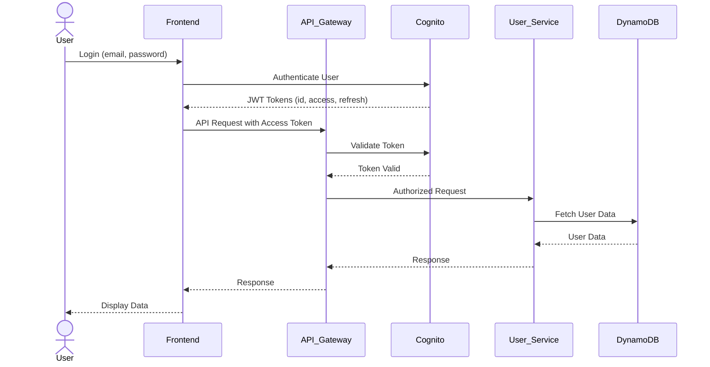

# Backend Architecture

### Service Architecture

#### Serverless Architecture
##### Function Organization
```text
src/
├── functions/          # Individual Lambda functions
│   ├── users/
│   │   ├── createUser.ts
│   │   ├── getUser.ts
│   │   └── loginUser.ts
│   ├── products/
│   │   ├── getProducts.ts
│   │   └── createProduct.ts
│   └── orders/
│       ├── createOrder.ts
│       └── getOrder.ts
├── services/           # Business logic modules shared across functions
├── models/             # Data models/interfaces
├── utils/              # Utility functions
└── config/             # Configuration files
```

##### Function Template
```typescript
import { APIGatewayProxyEvent, APIGatewayProxyResult } from 'aws-lambda';
import { successResponse, errorResponse } from '../utils/apiResponses'; // Assuming utility for responses

export const handler = async (event: APIGatewayProxyEvent): Promise<APIGatewayProxyResult> => {
  try {
    // Your function logic here
    const data = { message: 'Hello from Lambda!' };
    return successResponse(200, data);
  } catch (error) {
    console.error(error);
    return errorResponse(500, 'Internal Server Error');
  }
};
```

### Database Architecture

#### Schema Design
```sql
-- DynamoDB tables will be defined using AWS CDK or Serverless Framework.
-- Example:
-- Users Table:
-- Partition Key: id (String)
-- Attributes: email (String), passwordHash (String), firstName (String), lastName (String), createdAt (String), updatedAt (String)
-- Global Secondary Index: email-index (Partition Key: email)

-- Products Table:
-- Partition Key: id (String)
-- Attributes: name (String), description (String), price (Number), imageUrl (String), category (String), stock (Number), createdAt (String), updatedAt (String)
-- Global Secondary Index: category-index (Partition Key: category)

-- Orders Table:
-- Partition Key: id (String)
-- Attributes: userId (String), orderDate (String), totalAmount (Number), status (String), shippingAddressId (String), createdAt (String), updatedAt (String)
-- Global Secondary Index: userId-index (Partition Key: userId)

-- OrderItems Table:
-- Partition Key: id (String)
-- Attributes: orderId (String), productId (String), quantity (Number), price (Number)
-- Global Secondary Index: orderId-index (Partition Key: orderId)

-- Addresses Table:
-- Partition Key: id (String)
-- Attributes: userId (String), street (String), city (String), state (String), zipCode (String), country (String), isDefault (Boolean)
-- Global Secondary Index: userId-index (Partition Key: userId)
```

#### Data Access Layer
```typescript
import { DynamoDBClient } from '@aws-sdk/client-dynamodb';
import { DynamoDBDocumentClient, GetCommand, PutCommand, UpdateCommand, DeleteCommand, QueryCommand } from '@aws-sdk/lib-dynamodb';
import { User } from '../models/User'; // Assuming User model

const client = new DynamoDBClient({});
const ddbDocClient = DynamoDBDocumentClient.from(client);

export const userRepository = {
  async getUserById(id: string): Promise<User | undefined> {
    const command = new GetCommand({
      TableName: 'Users',
      Key: { id },
    });
    const { Item } = await ddbDocClient.send(command);
    return Item as User;
  },

  async createUser(user: User): Promise<User> {
    const command = new PutCommand({
      TableName: 'Users',
      Item: user,
    });
    await ddbDocClient.send(command);
    return user;
  },

  // ... other CRUD operations for User
};
```

### Authentication and Authorization

#### Auth Flow


#### Middleware/Guards
```typescript
// Example Express.js middleware for token validation (if not using API Gateway's built-in auth)
import { Request, Response, NextFunction } from 'express';
import jwt from 'jsonwebtoken';

interface AuthenticatedRequest extends Request {
  user?: { id: string; email: string; };
}

export const authenticateToken = (req: AuthenticatedRequest, res: Response, next: NextFunction) => {
  const authHeader = req.headers['authorization'];
  const token = authHeader && authHeader.split(' ')[1];

  if (token == null) return res.sendStatus(401); // No token

  jwt.verify(token, process.env.JWT_SECRET as string, (err: any, user: any) => {
    if (err) return res.sendStatus(403); // Invalid token
    req.user = user;
    next();
  });
};
```