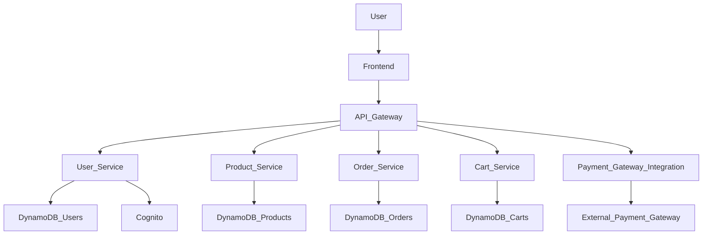

# Components

### User Management Service
**Responsibility:** Handles user registration, login, profile management, and authentication.

**Key Interfaces:**
- User registration API (`POST /users/register`)
- User login API (`POST /users/login`)
- User profile API (`GET /users/{id}`, `PUT /users/{id}`)

**Dependencies:** DynamoDB (for user data), AWS Cognito (for authentication)

**Technology Stack:** AWS Lambda, Node.js, Express.js

### Product Catalog Service
**Responsibility:** Manages product information, including creation, retrieval, update, and deletion of products.

**Key Interfaces:**
- Get all products API (`GET /products`)
- Get product by ID API (`GET /products/{id}`)
- Create product API (`POST /products`)

**Dependencies:** DynamoDB (for product data)

**Technology Stack:** AWS Lambda, Node.js, Express.js

### Order Processing Service
**Responsibility:** Manages the lifecycle of customer orders, from creation to fulfillment.

**Key Interfaces:**
- Create order API (`POST /orders`)
- Get order by ID API (`GET /orders/{id}`)
- Update order status API (`PUT /orders/{id}/status`)

**Dependencies:** DynamoDB (for order and order item data), Product Catalog Service

**Technology Stack:** AWS Lambda, Node.js, Express.js

### Shopping Cart Service
**Responsibility:** Manages items in a user's shopping cart.

**Key Interfaces:**
- Add item to cart API (`POST /cart`)
- Get cart contents API (`GET /cart`)
- Update cart item quantity API (`PUT /cart/{productId}`)
- Remove item from cart API (`DELETE /cart/{productId}`)

**Dependencies:** DynamoDB (for cart data), Product Catalog Service

**Technology Stack:** AWS Lambda, Node.js, Express.js

### Payment Gateway Integration
**Responsibility:** Handles secure processing of payments.

**Key Interfaces:**
- Process payment API (`POST /payments`)

**Dependencies:** External Payment Gateway API (e.g., Stripe, PayPal)

**Technology Stack:** AWS Lambda, Node.js

### Component Diagrams
