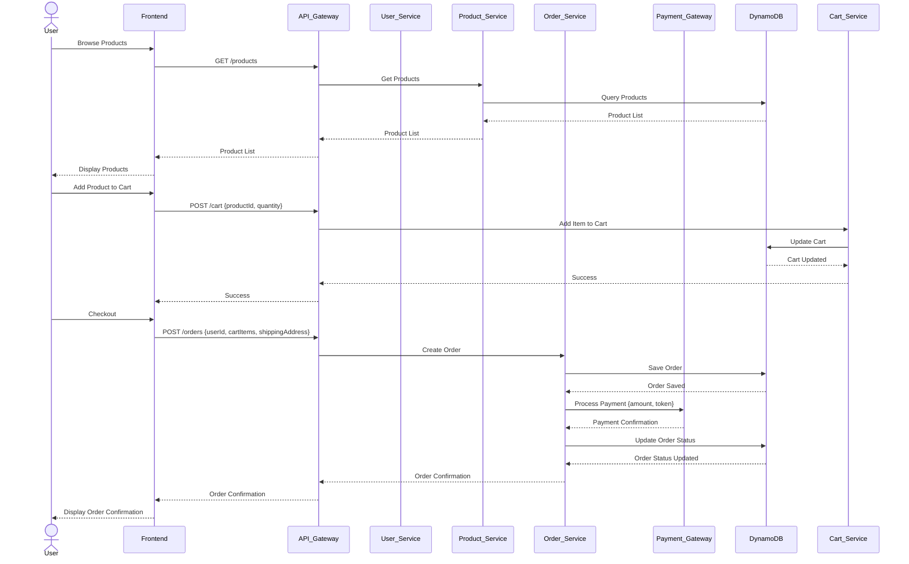

# Core Workflows

```mermaid
sequenceDiagram
    actor User
    participant Frontend
    participant API_Gateway
    participant User_Service
    participant Product_Service
    participant Order_Service
    participant Payment_Gateway
    participant DynamoDB

    User->>Frontend: Browse Products
    Frontend->>API_Gateway: GET /products
    API_Gateway->>Product_Service: Get Products
    Product_Service->>DynamoDB: Query Products
    DynamoDB-->>Product_Service: Product List
    Product_Service-->>API_Gateway: Product List
    API_Gateway-->>Frontend: Product List
    Frontend-->>User: Display Products

    User->>Frontend: Add Product to Cart
    Frontend->>API_Gateway: POST /cart {productId, quantity}
    API_Gateway->>Cart_Service: Add Item to Cart
    Cart_Service->>DynamoDB: Update Cart
    DynamoDB-->>Cart_Service: Cart Updated
    Cart_Service-->>API_Gateway: Success
    API_Gateway-->>Frontend: Success

    User->>Frontend: Checkout
    Frontend->>API_Gateway: POST /orders {userId, cartItems, shippingAddress}
    API_Gateway->>Order_Service: Create Order
    Order_Service->>DynamoDB: Save Order
    DynamoDB-->>Order_Service: Order Saved
    Order_Service->>Payment_Gateway: Process Payment {amount, token}
    Payment_Gateway-->>Order_Service: Payment Confirmation
    Order_Service->>DynamoDB: Update Order Status
    DynamoDB-->>Order_Service: Order Status Updated
    Order_Service-->>API_Gateway: Order Confirmation
    API_Gateway-->>Frontend: Order Confirmation
    Frontend-->>User: Display Order Confirmation
```