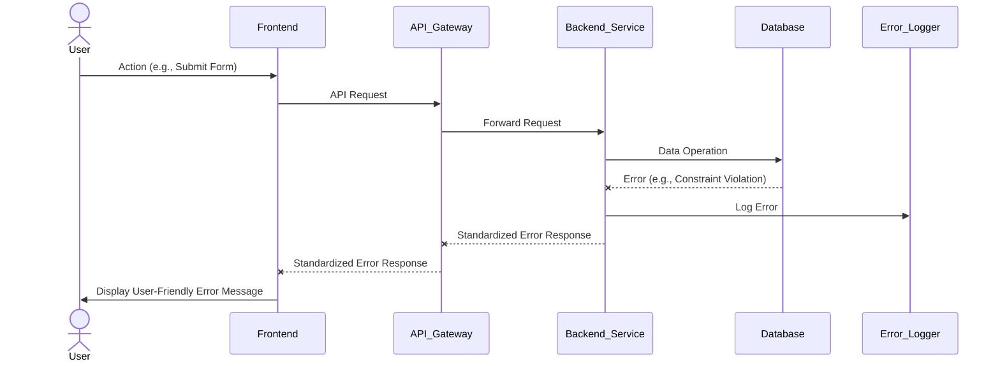

# Error Handling Strategy

### Error Flow


### Error Response Format
```typescript
interface ApiError {
  error: {
    code: string;
    message: string;
    details?: Record<string, any>;
    timestamp: string;
    requestId: string;
  };
}
```

### Frontend Error Handling
```typescript
import { AxiosError } from 'axios';
import { toast } from 'react-toastify'; // Example for displaying notifications

export const handleFrontendError = (error: AxiosError<ApiError>) => {
  if (error.response) {
    // Server responded with a status code outside the 2xx range
    const { code, message, details } = error.response.data.error;
    console.error(`API Error [${code}]: ${message}`, details);
    toast.error(`Error: ${message}`);
  } else if (error.request) {
    // Request was made but no response received
    console.error('Network Error:', error.request);
    toast.error('Network error. Please check your internet connection.');
  } else {
    // Something happened in setting up the request that triggered an Error
    console.error('Client Error:', error.message);
    toast.error('An unexpected error occurred.');
  }
};
```

### Backend Error Handling
```typescript
import { Request, Response, NextFunction } from 'express';

// Custom error class for API errors
export class ApiError extends Error {
  statusCode: number;
  errorCode: string;
  details?: Record<string, any>;

  constructor(statusCode: number, errorCode: string, message: string, details?: Record<string, any>) {
    super(message);
    this.statusCode = statusCode;
    this.errorCode = errorCode;
    this.details = details;
    Object.setPrototypeOf(this, ApiError.prototype);
  }
}

// Global error handler middleware
export const errorHandler = (err: Error, req: Request, res: Response, next: NextFunction) => {
  console.error('Backend Error:', err); // Log the full error for debugging

  if (err instanceof ApiError) {
    return res.status(err.statusCode).json({
      error: {
        code: err.errorCode,
        message: err.message,
        details: err.details,
        timestamp: new Date().toISOString(),
        requestId: req.headers['x-request-id'] || 'N/A', // Assuming request ID is passed
      },
    });
  }

  // Generic error for unhandled exceptions
  res.status(500).json({
    error: {
      code: 'INTERNAL_SERVER_ERROR',
      message: 'An unexpected error occurred.',
      timestamp: new Date().toISOString(),
      requestId: req.headers['x-request-id'] || 'N/A',
    },
  });
};
```