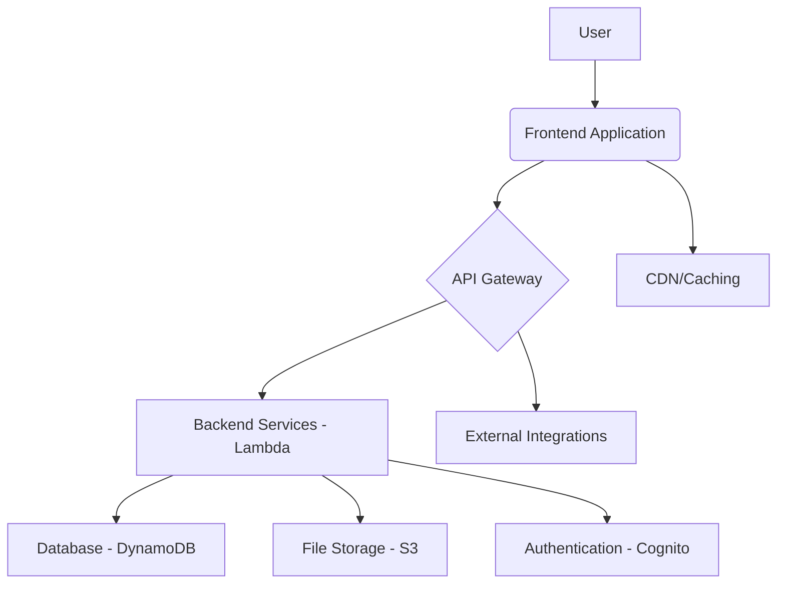

# High Level Architecture

### Technical Summary
This architecture employs a modern fullstack approach, utilizing a component-based frontend and a microservices-oriented backend. The frontend and backend communicate via a RESTful API. The application will be deployed on a cloud platform, leveraging serverless functions for scalability and cost-efficiency. This architecture is designed to meet the performance, scalability, and maintainability goals outlined in the PRD.

### Platform and Infrastructure Choice
**Platform:** AWS
**Key Services:** AWS Lambda, API Gateway, DynamoDB, S3, Cognito
**Deployment Host and Regions:** us-east-1

### Repository Structure
**Structure:** Monorepo
**Monorepo Tool:** Nx
**Package Organization:** `apps/` for applications (web, api), `packages/` for shared code (shared types, UI components, config)

### High Level Architecture Diagram

### Architectural Patterns
- **Serverless Architecture:** Utilizing AWS Lambda for backend services - _Rationale:_ Scalability, reduced operational overhead, and cost-efficiency.
- **Component-Based UI:** Reusable React components with TypeScript - _Rationale:_ Promotes reusability, maintainability, and type safety across the frontend codebase.
- **Repository Pattern:** Abstract data access logic - _Rationale:_ Decouples business logic from data storage details, enabling easier testing and future database migration flexibility.
- **API Gateway Pattern:** Single entry point for all API calls - _Rationale:_ Centralizes concerns like authentication, rate limiting, and monitoring for backend services.