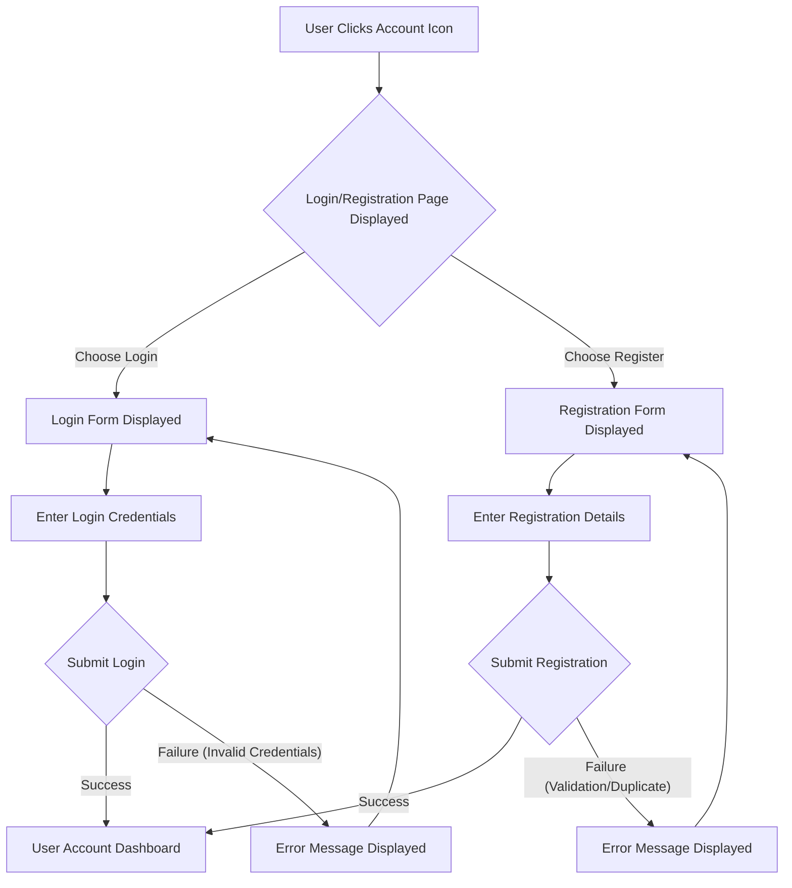

# Barem UI/UX Specification

## 1. Introduction

This document defines the user experience goals, information architecture, user flows, and visual design specifications for Barem's user interface. It serves as the foundation for visual design and frontend development, ensuring a cohesive and user-centered experience.

### 1.1 Overall UX Goals & Principles

Based on the "User Interface Design Goals" section of the PRD, here are the core UX goals and design principles for Barem:

*   **Overall UX Vision:** Clean, modern, and intuitive, prioritizing a frictionless path from product discovery to checkout. The design should feel familiar to users of popular e-commerce sites, ensuring predictable and easy-to-understand navigation and actions.
*   **Key Interaction Paradigms:**
    *   **Browsing:** Standard grid-based layout for product listings with clear filtering and sorting.
    *   **Search:** Prominent search bar leading to a dedicated results page.
    *   **Cart Management:** Quick additions via mini-cart/slide-out, full-page view for review.
    *   **Checkout:** Linear, multi-step process for shipping and payment.
*   **Core Screens and Views:** Homepage, Shop/Product Listing, Product Detail, Shopping Cart, User Account (Login, Registration, Order History), Store Manager Dashboard (Product & Order Management).
*   **Accessibility:** WCAG 2.1 Level AA compliance.
*   **Branding:** Minimal and modern, focusing on clean typography and a simple color palette to highlight product imagery.
*   **Target Platforms:** Responsive web application (desktop and mobile browsers) and a separate React Native mobile application.

### Functional Layout Descriptions

#### Homepage

The Barem homepage serves as the primary entry point for users, designed for product discovery and navigation.

*   **Header Area:**
    *   **Site Identity:** Prominent Barem logo.
    *   **Global Search:** A clear and accessible search bar for product lookup.
    *   **User Utilities:** Icons/links for user account (login/profile), wishlist, and shopping cart status.
*   **Primary Navigation:**
    *   A main navigation bar providing access to key product categories (e.g., Headphones, Smart Phones) and site sections (e.g., Shop, Contact). The 'Blog' section has been removed to maintain a focus on core e-commerce functionality.
*   **Content Sections:**
    *   **Hero/Promotional Area:** A prominent section for highlighting key products or promotions, with a clear call to action (e.g., "Shop Now").
    *   **Product Category Browsing:** Sections allowing users to explore products by category, typically presented as clickable cards or links.
    *   **Product Listing Areas:** Multiple sections (e.g., "Trending Products," "Latest Products," "Featured Products") displaying product cards in a grid or carousel format. Each product card will functionally show an image, name, and price, with an option to view details or add to cart.
*   **Footer Area:**
    *   Standard site-wide footer containing contact information, quick links (e.g., Privacy, FAQs), and potentially a newsletter signup.

#### Product Detail Page

The Product Detail Page provides comprehensive information about a single product and facilitates its addition to the cart.

*   **Product Media Display:**
    *   A primary area for displaying the main product image, with smaller thumbnails or a gallery for additional product views.
*   **Product Information Panel:**
    *   **Product Title:** Clearly displays the product's name.
    *   **Price:** Shows the current price of the product.
    *   **Description:** A concise and detailed description of the product's features and benefits.
    *   **Availability/Stock:** Indicates product availability.
*   **Action Area:**
    *   **Quantity Selector:** Allows users to specify the desired quantity.
    *   **"Add to Cart" Button:** A prominent button to add the product to the shopping cart.
    *   **"Buy It Now" Button:** An alternative direct purchase option.
*   **Related Products Section:**
    *   A section (e.g., "You May Also Like") displaying functionally similar or complementary products, each with an image, name, and price.
*   **Footer Area:**
    *   The standard site-wide footer.

## 2. Information Architecture (IA)

### 2.1 Site Map / Screen Inventory

```mermaid
graph TD
    A[Homepage] --> B[Shop/Product Listing Page]
    B --> C[Product Detail Page]
    A --> C
    C --> D[Shopping Cart Page]
    D --> E[Order Confirmation Page]
    A --> F[User Account Page]
    F --> F1[Login/Registration]
    F --> F2[Order History]
    A --> G[Store Manager Dashboard]
    G --> G1[Product Management]
    G --> G2[Order Management]
    G --> G3[User Role Management (Admin Only)]
```

**Rationale:**
*   This site map prioritizes the core functional flows identified in the PRD.
*   It shows the main entry points (Homepage) and how users can navigate to product listings, individual product details, and then to the cart and order confirmation.
*   Separate branches are included for user account management and the distinct store manager functionalities, reflecting the different user roles.
*   The diagram is kept high-level, focusing on the main pages rather than every possible sub-view, aligning with the functional and concise approach.

## 3. User Flows

### 3.1 User Flow: Store Manager - Add New Product (Revised)

*   **User Goal:** As a store manager, I want to add a new product to the catalog so that it becomes available for customers to purchase.

*   **Entry Point:** Store Manager is logged in and has appropriate permissions.

*   **Success Criteria:** A new product is successfully added to the product catalog and is viewable in the system.

```mermaid
graph TD
    A[Store Manager Logs In] --> B{Navigate to Store Manager Dashboard}
    B --> C[Access Product Management]
    C --> D[Click "Add New Product" Button]
    D --> E[Product Creation Form Displayed]
    E -- Fill Out Form --> F[Fill Out Product Details Form (Name, Description, Price, Stock)]
    E -- Cancel --> C
    F --> G[Click "Submit" Button]
    G --> H{System Processes Request}
    H -- Success --> I[Confirmation Message Displayed]
    H -- Success --> J[New Product Appears in Product List]
    H -- Validation Error --> K[Validation Error Message Displayed on Form]
    K --> E
    H -- Server Error --> L[Generic Server Error Message Displayed]
```

**Rationale for Changes:**
*   **`E -- Cancel --> C`**: Added a functional path for the manager to cancel the form and return to the Product Management view.
*   **`F[Fill Out Product Details Form (Name, Description, Price, Stock)]`**: Added a brief functional description of the key fields to align with PRD requirements.
*   **`H -- Validation Error --> K[Validation Error Message Displayed on Form]`**: Clarified that errors leading back to the form are typically validation-related, allowing the user to correct input.
*   **`H -- Server Error --> L[Generic Server Error Message Displayed]`**: Added a separate path for non-correctable server errors, which would typically not loop back to the form for user correction.

### 3.2 User Flow: View Order History (Revised)

*   **User Goal:** As a user, I want to view a history of my past orders so that I can keep track of my purchases.

*   **Entry Point:** User is on any page of the Barem website.

*   **Success Criteria:** The user successfully accesses and views their list of past orders.

```mermaid
graph TD
    A[User on any page] --> B{Click User Account/Profile Icon}
    B --> C[Login/Registration Page Displayed]
    C -- If Not Logged In --> D[Enter Credentials & Log In]
    D -- Login Success --> E[User Account Dashboard Displayed]
    D -- Login Failure --> C1[Error Message Displayed]
    C1 --> C
    C -- If Already Logged In --> E
    E --> F[Click "Order History" Link]
    F --> G[Order History Page Displayed]
    G -- Orders Exist --> H[List of Past Orders Displayed]
    G -- No Orders --> H1[Message: "No Orders Found"]
    H --> I[View Order Details (Optional)]
    I --> J[Order Detail Page Displayed]
    J --> G
```

**Rationale for Changes:**
*   **`D -- Login Failure --> C1[Error Message Displayed]` and `C1 --> C`**: Added a functional path for failed login attempts, directing the user back to the login page with an error message.
*   **`G -- No Orders --> H1[Message: "No Orders Found"]`**: Addressed the functional scenario where a user has no past orders, ensuring the UI provides appropriate feedback.
*   **`I --> J[Order Detail Page Displayed]` and `J --> G`**: Clarified the functional flow for viewing order details and returning to the order history.

### 3.3 User Flow: User Account Creation and Login

*   **User Goal:** As a user, I want to create an account and log in to access personalized features like order history and saved carts.

*   **Entry Point:** User clicks on the User Account/Profile icon in the header.

*   **Success Criteria:** User successfully creates an account or logs in, and is redirected to their User Account Dashboard.



**Rationale:**
*   This flow clearly separates the login and registration paths from a single entry point.
*   It includes functional success and failure paths for both login and registration, with error messages directing the user back to the respective forms for correction.
*   Upon successful completion of either process, the user is directed to a central "User Account Dashboard," which serves as a functional hub for their personalized features.

### 3.4 User Flow: Buyer's Product Discovery and Purchase (Revised)

*   **User Goal:** As a buyer, I want to find a product, add it to my cart, and complete a purchase.

*   **Entry Point:** User lands on the Barem homepage.

*   **Success Criteria:** User successfully completes an order and receives confirmation.

```mermaid
graph TD
    A[Homepage] --> B{Browse Categories / Use Search}
    B -- Browse Categories --> C[Product Listing Page]
    B -- Use Search --> D[Search Results Page]
    C --> E[Click Product Card]
    D --> E
    E[Product Detail Page] --> F{Add to Cart / Buy It Now}
    F -- Add to Cart --> F1[Mini-Cart Confirmation / Notification]
    F1 -- Continue Shopping --> C
    F1 -- View Cart / Checkout --> G[Shopping Cart Page]
    F -- Buy It Now --> CH1[Checkout Process: Shipping Info]
    G --> I[Click "Proceed to Checkout" Button]
    I --> CH1
    CH1 --> CH2[Checkout Process: Payment Info]
    CH2 --> CH3[Checkout Process: Review Order]
    CH3 --> CH4[Click "Place Order" Button]
    CH4 --> H[Order Confirmation Page]
    H --> J[Purchase Complete]
```

**Rationale for Changes:**
*   **`F1[Mini-Cart Confirmation / Notification]` and subsequent paths:** This explicitly represents the functional behavior after "Add to Cart," allowing the user to either continue shopping or proceed to the full cart/checkout, aligning with the PRD's mention of a "slide-out or mini-cart."
*   **`CH1`, `CH2`, `CH3`, `CH4` nodes:** These new nodes explicitly represent the "linear, multi-step process" for checkout (Shipping Info, Payment Info, Review Order, Place Order), which was a critical missing functional detail from the PRD.

## 4. Wireframes & Mockups

This section clarifies where detailed visual designs will be created (e.g., Figma, Sketch, etc.) and how to reference them. If low-fidelity wireframes are needed, I can help conceptualize layouts for key screens, focusing on functional placement of elements rather than detailed visual aesthetics.

### 4.1 Design Files

**Question:** Where will the primary design files for Barem be hosted or created (e.g., Figma, Sketch, Adobe XD, Miro, etc.)? Please provide a general link or a description of how they will be referenced.

### 4.2 Key Screen Layouts

This subsection will functionally describe the layout of key screens, focusing on the placement of major UI elements.

### 4.2.1 Key Screen Layout: Product Detail Page

**Functional Layout Description:**

The Product Detail Page is functionally divided into several key areas to present product information and enable user actions.

*   **Top Area (Header & Navigation):**
    *   The standard site-wide header (Barem logo, search, user utilities) and primary navigation remain consistent at the top.
*   **Main Content Area:**
    *   **Left Section (Product Media):** Occupies a significant portion of the left side. This area is dedicated to displaying the primary product image. Below or beside it, a functional carousel or grid of smaller thumbnail images allows users to view alternate angles or variations of the product.
    *   **Right Section (Product Information & Actions):** Occupies the right side, adjacent to the product media. This section contains:
        *   **Product Title:** Prominently displayed at the top of this section.
        *   **Price:** Located directly below the title.
        *   **Brief Description:** A concise summary of the product's key features.
        *   **Action Block:** Contains the core interaction elements:
            *   **Quantity Selector:** An input field or set of buttons to adjust the desired quantity.
            *   **"Add to Cart" Button:** A primary call-to-action button.
            *   **"Buy It Now" Button:** A secondary call-to-action button for direct purchase.
        *   **Availability/Stock Information:** Indicates if the product is in stock and potentially the quantity remaining.
    *   **Lower Section (Detailed Description):** Spans the full width below the main product media and information panel. This area provides a comprehensive, detailed description of the product's specifications, features, and benefits.
    *   **Bottom Section (Related Products):** Located below the detailed description. This section displays a functional grid or carousel of "You May Also Like" products, each with an image, name, and price, providing cross-selling opportunities.
*   **Bottom Area (Footer):**
    *   The standard site-wide footer remains consistent at the bottom of the page.

**Rationale:**
*   This layout prioritizes the product image and key purchase actions, making them immediately visible upon page load.
*   The separation of media and information allows for efficient scanning.
*   The detailed description and related products are placed lower, accessible for users seeking more information or alternative options.

## 5. Component Library / Design System

This section will discuss whether to use an existing design system or create a new one. If creating new, we will identify foundational components and their key states. Note that detailed technical specifications for implementation belong in the front-end architecture document.

### 5.1 Design System Approach

**Question:** What is the intended design system approach for Barem? Will we be:

1.  **Utilizing an existing UI component library/framework** (e.g., Material-UI, Ant Design, Bootstrap, Chakra UI) and adapting it to Barem's branding?
2.  **Building a custom component library** from scratch, tailored specifically for Barem?
3.  **A hybrid approach**, using an existing library as a base but extending it with custom components where needed?

Please select one of the options above, or provide your own approach.

### 5.2 Core Components

This subsection will identify foundational UI components for Barem and describe their key functional states.

### 5.2.1 Core Component Example: Product Card

The Product Card is a fundamental component used across various listing pages (Homepage, Product Listing Page, Search Results).

*   **Purpose:** To display essential information about a single product and provide quick access to its details or purchase options.

*   **Functional States:**
    *   **Default:** Displays product image, name, and price. It is clickable to navigate to the Product Detail Page.
    *   **Hover:** Visual feedback when the user's cursor is over the card (e.g., slight elevation, border change) to indicate interactivity.
    *   **Loading:** A placeholder state (e.g., skeleton loader, spinner) shown while product data is being fetched.
    *   **Out of Stock:** Visually indicates that the product is not currently available (e.g., "Out of Stock" overlay, disabled "Add to Cart" button).
    *   **Discounted:** Displays both original and discounted prices, potentially with a visual badge indicating the discount.

## 6. Branding & Style Guide

This section will link to existing style guides or define key brand elements. It ensures consistency with company brand guidelines if they exist.

### 6.1 Visual Identity

**Question:** Is there an existing brand guidelines document or a link to one that defines Barem's visual identity (e.g., logo usage, overall aesthetic principles)? If not, we can functionally state that the visual identity will be derived from the "minimal and modern" vision outlined in the PRD.

### 6.2 Color Palette

The color palette for Barem will be minimalistic and modern, designed to be appealing and subtle, allowing product imagery and key actions to stand out.

*   **Primary Color:** A soft, clean **White** (e.g., `#F8F8F8` or similar) for primary backgrounds, content areas, and main elements, providing a sense of spaciousness and clarity.
*   **Secondary Color:** A subtle, complementary **Gray** (e.g., `#E0E0E0` or similar) for secondary backgrounds, borders, and less prominent UI elements, adding depth without distraction.
*   **Accent Color:** A vibrant **Green** (e.g., `#4CAF50` or similar) specifically reserved for primary calls to action like "Buy Now" buttons, and other key interactive elements that require immediate user attention.
*   **Neutral Colors:**
    *   **White:** (`#FFFFFF`) for crisp, clean elements and text backgrounds.
    *   **Black/Dark Gray:** (`#212121` or similar) for primary text, headings, and strong contrasts.
    *   **Medium Gray:** (`#757575` or similar) for secondary text, icons, and subtle dividers.
    *   **Light Gray:** (`#BDBDBD` or similar) for disabled states, borders, and subtle backgrounds.
*   **Functional Colors:**
    *   **Success:** A clear, positive **Green** (e.g., `#4CAF50` or similar).
    *   **Warning:** A distinct **Orange** (e.g., `#FF9800` or similar).
    *   **Error:** A strong **Red** (e.g., `#F44336` or similar).

## 6.3 Typography

Barem will utilize a clean and modern typography system, prioritizing readability and visual hierarchy.

*   **Font Families:**
    *   **Primary:** A modern sans-serif font (e.g., Roboto, Open Sans, Lato) for headings and body text, chosen for its readability across various screen sizes.
    *   **Secondary:** (Optional) A complementary sans-serif font for specific elements or a slightly different weight/style of the primary font.
    *   **Monospace:** A standard monospace font (e.g., Inconsolata, Fira Code) for code snippets or technical displays if needed.
*   **Type Scale:** A well-defined type scale will ensure consistent and hierarchical text sizing.
    *   **H1:** Large, bold for main page titles.
    *   **H2-H6:** Progressively smaller for section titles and subheadings.
    *   **Body:** Standard size for main content text.
    *   **Small:** Smaller size for captions, legal text, and less prominent information.
*   **Weights:** A limited set of font weights (e.g., Regular, Medium, Bold) will be used to maintain visual consistency and clarity.

## 6.4 Iconography

Barem will use a consistent and clear set of icons to enhance usability and visual communication.

*   **Icon Library:** A well-established icon library (e.g., Material Icons, Font Awesome, Feather Icons) will be adopted to ensure consistency, scalability (SVG), and ease of use.
*   **Usage Guidelines:** Icons will be used sparingly and purposefully, primarily to:
    *   Represent common actions (e.g., search, cart, user profile).
    *   Aid navigation (e.g., arrows, menu toggles).
    *   Provide visual cues (e.g., success/error indicators).
    *   Maintain a consistent visual style (line-based or filled, consistent stroke weight).

## 6.5 Spacing & Layout

A systematic approach to spacing and layout will ensure visual harmony, readability, and responsiveness.

*   **Grid System:** A flexible 12-column grid system will be used to structure content and ensure consistent alignment across different screen sizes.
*   **Spacing Scale:** A defined spacing scale (e.g., based on multiples of 4px or 8px) will be applied for margins, padding, and gaps between elements, promoting visual rhythm and consistency.
*   **Layout Adaptations:** Content will adapt fluidly to different screen sizes, utilizing responsive design principles (fluid grids, flexible images, media queries).

## 7. Accessibility Requirements

Barem will aim for WCAG 2.1 Level AA compliance to ensure the application is usable by a wide range of people, including those with disabilities.

*   **Compliance Target:** WCAG 2.1 Level AA.
*   **Key Requirements:**
    *   **Visual:**
        *   Color contrast ratios: Minimum 4.5:1 for text and interactive elements.
        *   Focus indicators: Clear visual indicators for keyboard focus on interactive elements.
        *   Text sizing: Users can resize text up to 200% without loss of content or functionality.
    *   **Interaction:**
        *   Keyboard navigation: All interactive elements are operable via keyboard alone, with a logical tab order.
        *   Screen reader support: Semantic HTML and ARIA attributes will be used to ensure content is understandable by screen readers.
        *   Touch targets: Sufficiently large and spaced touch targets for mobile interactions.
    *   **Content:**
        *   Alternative text: All meaningful images will have descriptive alt text.
        *   Heading structure: Logical and hierarchical heading structure (H1, H2, etc.) for content organization.
        *   Form labels: All form fields will have associated, visible labels.
*   **Testing Strategy:** Accessibility will be integrated into the development and QA process, including automated checks, manual testing with assistive technologies, and user testing with diverse users.

## 8. Responsiveness Strategy

Barem will be a responsive web application, adapting its layout and content to provide an optimal viewing experience across a wide range of devices.

*   **Breakpoints:** Standard breakpoints will be defined for common device categories:
    *   **Mobile:** (e.g., up to 767px)
    *   **Tablet:** (e.g., 768px to 1023px)
    *   **Desktop:** (e.g., 1024px and above)
*   **Adaptation Patterns:**
    *   **Layout Changes:** Content columns will reflow, stack, or adjust their width based on screen size.
    *   **Navigation Changes:** Primary navigation may collapse into a hamburger menu on smaller screens.
    *   **Content Priority:** Less critical content may be hidden or reordered on smaller screens to prioritize essential information.
    *   **Interaction Changes:** Touch-friendly interactions will be prioritized on mobile devices.

## 9. Animation & Micro-interactions

Animations and micro-interactions will be used sparingly and purposefully to enhance the user experience, provide feedback, and guide attention, without being distracting.

*   **Motion Principles:** Animations will be subtle, fast, and functional, avoiding excessive or gratuitous motion. They will aim to provide clarity and delight.
*   **Key Animations:**
    *   **Loading Indicators:** Subtle animations (e.g., spinners, skeleton loaders) to indicate data fetching.
    *   **Button Feedback:** Visual feedback (e.g., slight scale, color change) on button clicks/hovers.
    *   **Cart Updates:** Subtle animations to confirm items added to cart or quantity changes.
    *   **Page Transitions:** Smooth transitions between pages to improve perceived performance.

## 10. Performance Considerations

Performance will be a key consideration in the UI/UX design, ensuring a fast and responsive user experience.

*   **Performance Goals:**
    *   **Page Load:** Main browsing and product pages should load under 3 seconds on a standard internet connection (as per PRD NFR2).
    *   **Interaction Response:** UI interactions (e.g., button clicks, form submissions) should have immediate visual feedback.
    *   **Animation FPS:** Animations should run smoothly at 60 frames per second where applicable.
*   **Design Strategies:**
    *   **Optimized Imagery:** Images will be optimized for web (appropriate formats, compression, lazy loading).
    *   **Efficient Animations:** Animations will be designed to be performant, avoiding complex effects that can cause jank.
    *   **Minimalist Design:** The clean and simple aesthetic naturally contributes to better performance by reducing visual clutter and complex rendering.
    *   **Progressive Loading:** Content may be loaded progressively to improve perceived performance.

## 11. Next Steps

After completing the UI/UX specification:

*   **Immediate Actions:**
    1.  Review this document with stakeholders (Product, Development, QA) for feedback and alignment.
    2.  Begin creating/updating detailed visual designs (wireframes, mockups, prototypes) in the chosen design tool (e.g., Figma).
    3.  Prepare for handoff to the Design Architect for front-end architecture planning and technical specification.
*   **Design Handoff Checklist:**
    *   All user flows documented.
    *   Component inventory complete.
    *   Accessibility requirements defined.
    *   Responsive strategy clear.
    *   Brand guidelines incorporated.
    *   Performance goals established.

## 12. Checklist Results

(This section will be populated after a UI/UX checklist is run against this document.)