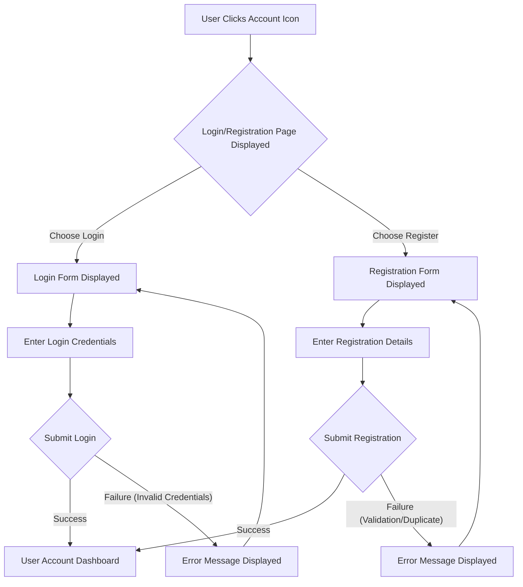

# User Flows

### 3.1 User Flow: Store Manager - Add New Product (Revised)

*   **User Goal:** As a store manager, I want to add a new product to the catalog so that it becomes available for customers to purchase.

*   **Entry Point:** Store Manager is logged in and has appropriate permissions.

*   **Success Criteria:** A new product is successfully added to the product catalog and is viewable in the system.

```mermaid
graph TD
    A[Store Manager Logs In] --> B{Navigate to Store Manager Dashboard}
    B --> C[Access Product Management]
    C --> D[Click "Add New Product" Button]
    D --> E[Product Creation Form Displayed]
    E -- Fill Out Form --> F[Fill Out Product Details Form (Name, Description, Price, Stock)]
    E -- Cancel --> C
    F --> G[Click "Submit" Button]
    G --> H{System Processes Request}
    H -- Success --> I[Confirmation Message Displayed]
    H -- Success --> J[New Product Appears in Product List]
    H -- Validation Error --> K[Validation Error Message Displayed on Form]
    K --> E
    H -- Server Error --> L[Generic Server Error Message Displayed]
```

**Rationale for Changes:**
*   **`E -- Cancel --> C`**: Added a functional path for the manager to cancel the form and return to the Product Management view.
*   **`F[Fill Out Product Details Form (Name, Description, Price, Stock)]`**: Added a brief functional description of the key fields to align with PRD requirements.
*   **`H -- Validation Error --> K[Validation Error Message Displayed on Form]`**: Clarified that errors leading back to the form are typically validation-related, allowing the user to correct input.
*   **`H -- Server Error --> L[Generic Server Error Message Displayed]`**: Added a separate path for non-correctable server errors, which would typically not loop back to the form for user correction.

### 3.2 User Flow: View Order History (Revised)

*   **User Goal:** As a user, I want to view a history of my past orders so that I can keep track of my purchases.

*   **Entry Point:** User is on any page of the Barem website.

*   **Success Criteria:** The user successfully accesses and views their list of past orders.

```mermaid
graph TD
    A[User on any page] --> B{Click User Account/Profile Icon}
    B --> C[Login/Registration Page Displayed]
    C -- If Not Logged In --> D[Enter Credentials & Log In]
    D -- Login Success --> E[User Account Dashboard Displayed]
    D -- Login Failure --> C1[Error Message Displayed]
    C1 --> C
    C -- If Already Logged In --> E
    E --> F[Click "Order History" Link]
    F --> G[Order History Page Displayed]
    G -- Orders Exist --> H[List of Past Orders Displayed]
    G -- No Orders --> H1[Message: "No Orders Found"]
    H --> I[View Order Details (Optional)]
    I --> J[Order Detail Page Displayed]
    J --> G
```

**Rationale for Changes:**
*   **`D -- Login Failure --> C1[Error Message Displayed]` and `C1 --> C`**: Added a functional path for failed login attempts, directing the user back to the login page with an error message.
*   **`G -- No Orders --> H1[Message: "No Orders Found"]`**: Addressed the functional scenario where a user has no past orders, ensuring the UI provides appropriate feedback.
*   **`I --> J[Order Detail Page Displayed]` and `J --> G`**: Clarified the functional flow for viewing order details and returning to the order history.

### 3.3 User Flow: User Account Creation and Login

*   **User Goal:** As a user, I want to create an account and log in to access personalized features like order history and saved carts.

*   **Entry Point:** User clicks on the User Account/Profile icon in the header.

*   **Success Criteria:** User successfully creates an account or logs in, and is redirected to their User Account Dashboard.



**Rationale:**
*   This flow clearly separates the login and registration paths from a single entry point.
*   It includes functional success and failure paths for both login and registration, with error messages directing the user back to the respective forms for correction.
*   Upon successful completion of either process, the user is directed to a central "User Account Dashboard," which serves as a functional hub for their personalized features.

### 3.4 User Flow: Buyer's Product Discovery and Purchase (Revised)

*   **User Goal:** As a buyer, I want to find a product, add it to my cart, and complete a purchase.

*   **Entry Point:** User lands on the Barem homepage.

*   **Success Criteria:** User successfully completes an order and receives confirmation.

```mermaid
graph TD
    A[Homepage] --> B{Browse Categories / Use Search}
    B -- Browse Categories --> C[Product Listing Page]
    B -- Use Search --> D[Search Results Page]
    C --> E[Click Product Card]
    D --> E
    E[Product Detail Page] --> F{Add to Cart / Buy It Now}
    F -- Add to Cart --> F1[Mini-Cart Confirmation / Notification]
    F1 -- Continue Shopping --> C
    F1 -- View Cart / Checkout --> G[Shopping Cart Page]
    F -- Buy It Now --> CH1[Checkout Process: Shipping Info]
    G --> I[Click "Proceed to Checkout" Button]
    I --> CH1
    CH1 --> CH2[Checkout Process: Payment Info]
    CH2 --> CH3[Checkout Process: Review Order]
    CH3 --> CH4[Click "Place Order" Button]
    CH4 --> H[Order Confirmation Page]
    H --> J[Purchase Complete]
```

**Rationale for Changes:**
*   **`F1[Mini-Cart Confirmation / Notification]` and subsequent paths:** This explicitly represents the functional behavior after "Add to Cart," allowing the user to either continue shopping or proceed to the full cart/checkout, aligning with the PRD's mention of a "slide-out or mini-cart."
*   **`CH1`, `CH2`, `CH3`, `CH4` nodes:** These new nodes explicitly represent the "linear, multi-step process" for checkout (Shipping Info, Payment Info, Review Order, Place Order), which was a critical missing functional detail from the PRD.